Why do we use containers ?

Project : Data Science Application ?

Developer_A needed to setup developement enviroment via installing anaconda, creating conda enviroment, installing database like MySQL, Mongodb etc.

Assume that another developer_B join the team to work on same project after some time but he is using a Linux/MacOS Machine, to do complete setup for his developement enviroment needed to install the all dependencies on linux machine.

Developer_A working on windows machine, what type of problems he faces.

- may possible that some libraries/dependencies mismatches. then application developed by developer_A will not work on the developer_B linux machine due to library mismatch.
- Assume that A helped B to setup the DEV Enviroment on linux and application apps working fine.
  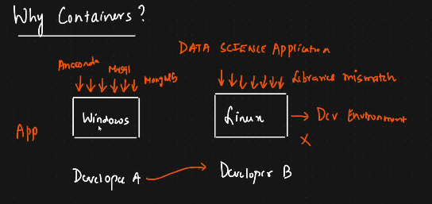
- Now, we needed to sent the application to QA enviroment on the server for testing purpose.
- let's say there is another team, installing application on the server they missed to install some dependencies then either entire application or some module may not work.
  
- QA team will compain the the App Developers team that application is not working properly on QA server but develper team will reply that it's working fine then there will be war of word between both the teams.

Such kind to scence will happens usually because we have to install the all dependencies manually. to deal with such problem docker container came into existance.

What are containers ?

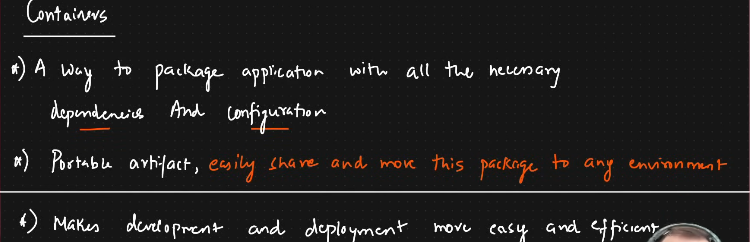
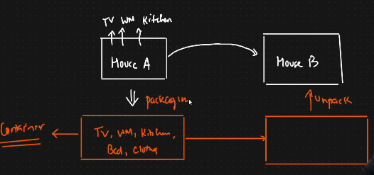

A way to package application with all necessary dependencies and configuration. It is portable artifact s.t we can easly share and move this package to any enviroment with all necessary dependencies and configuration. It makes developement and deployement more easy, efficiently and synchronously.
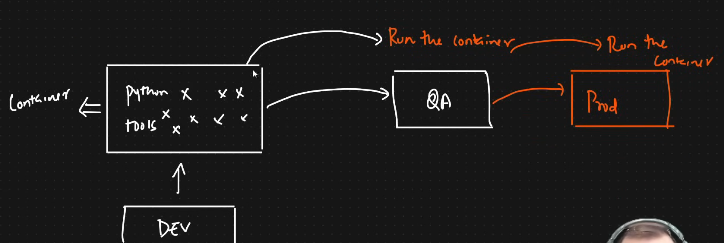

What is docker ?

Docker is an open platform for developing, shipping, and running applications.

Docker allows you to separate your applications from your infrastructure so you can deliver software quickly. With Docker, you can manage your infrastructure in the same ways you manage your applications.

By taking advantage of Docker’s methodologies for shipping, testing, and deploying code quickly, you can significantly reduce the delay between writing code and running it in production.
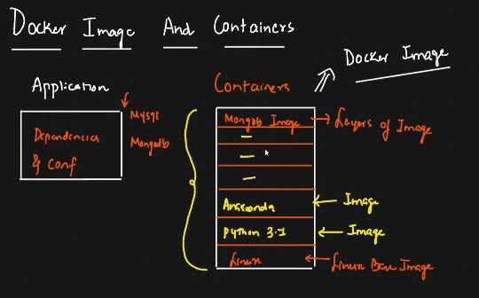

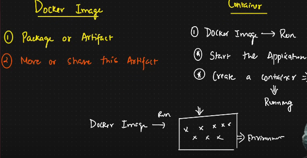

Docker vs Virtual Machine ?
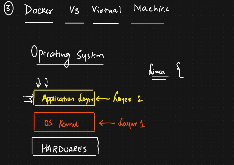
Which layer of operating systems they are vertualizing.
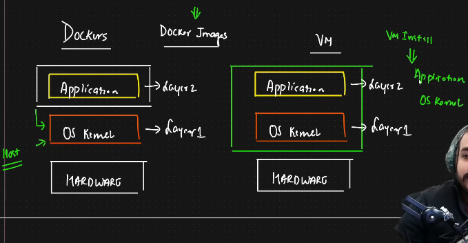

Advantanges vs Disadvantages ?
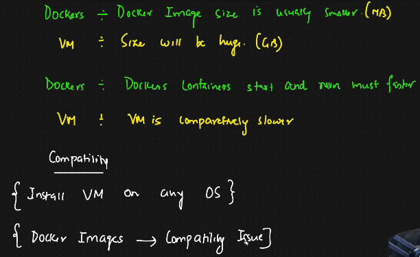
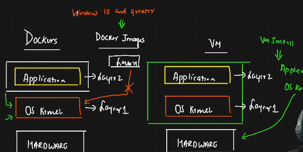

Containers vs Vertual Machine

Docker Image vs Containers

 Practical Implementatin of dockers
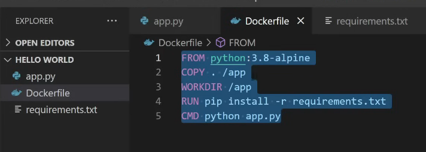

Commonds
`docker build -t welcome-app .`
`docker images`
docker run -p 5000(Host):5000(Container) ports
`docker run -p 5000:5000`
`docker ps` # number of containers running and know the host to container port.
`docker stop containerid` # to stop the running docker i.e container

deploying docker image into the docker hub repository
